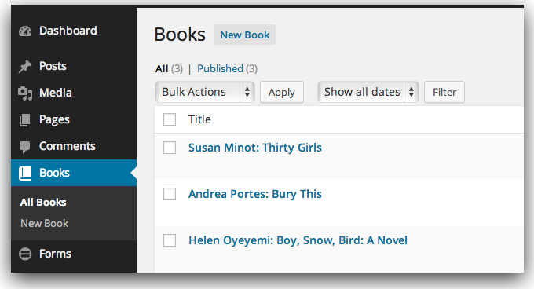
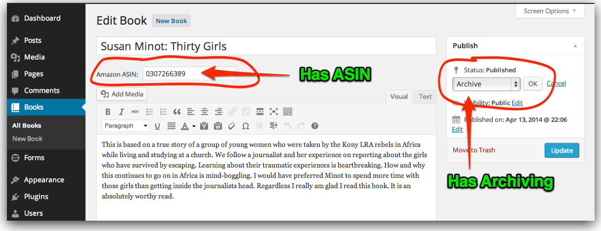

Gotham Gal Books
===============
This WordPress plugin was developed to answer [Fred Wilson's call](http://avc.com/2014/04/a-wordpress-plugin-for-a-books-list/) for such a plugin.

This plugin adds a "Books" custom post type with an "Archive" status option for Books she no longer wants to highlight, and a `[gothamgal-books]` shortcode to be used on her books page. It was developed specifically for [Gotham Gal's Books of the Moment](http://gothamgal.com/books-of-the-moment/) page and uses the existing HTML markup and assumes the existing CSS but could be used as the base for a similar plugin if desired.

##Download
You can download a ZIP copy of the plugin [here](https://github.com/newclarity/gothamgal-books/archive/master.zip) but I'd suggest renaming the subdirectory from `gothamgal-books-master` to just `gothamgal-books`.

##Screenshots

###Books Post Type in the Admin

###ASIN and Archiving

###Page using a Shortcode

